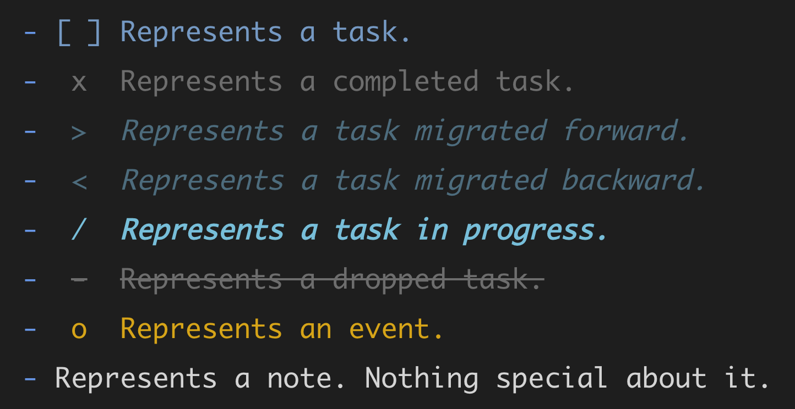
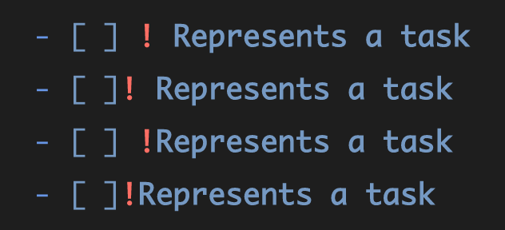
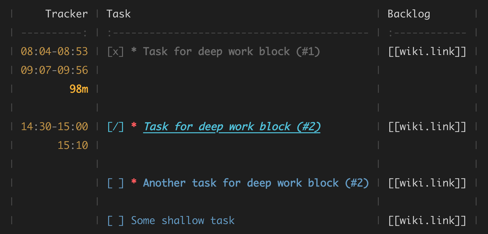
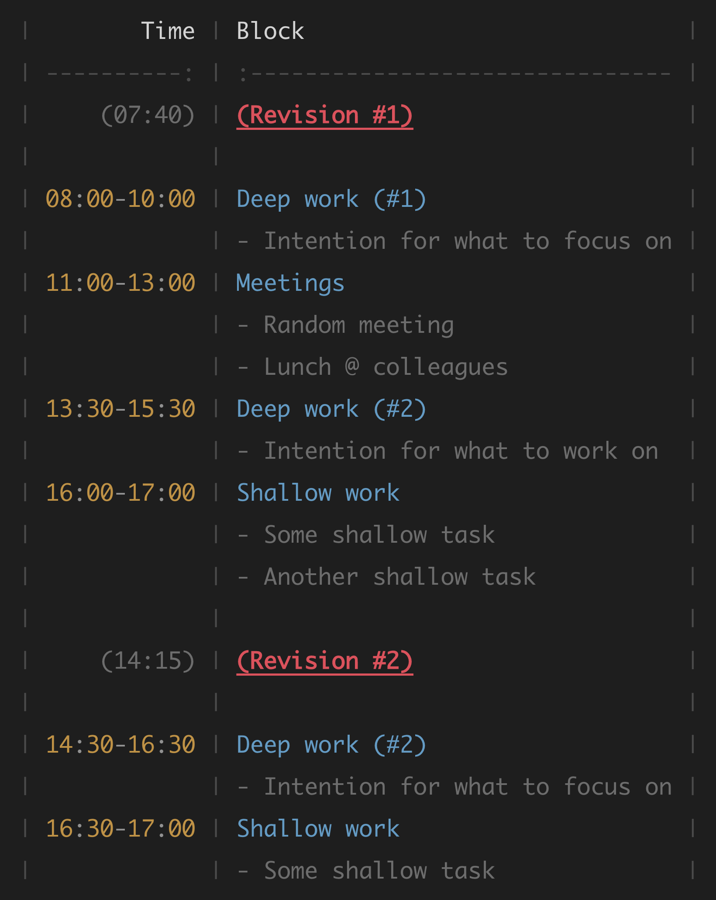
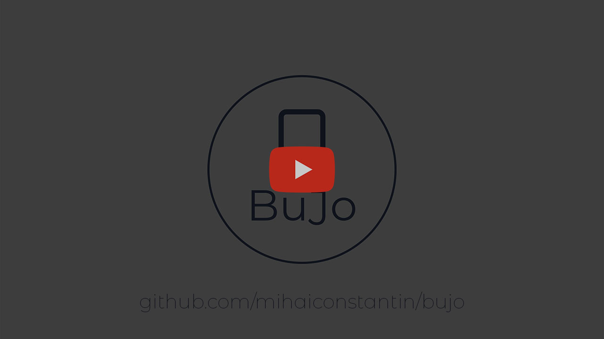

<div align="center">
    
</div>

<h1 align="center">Bullet Journal Markdown Workflows</h1>

<div align="center">
    
    
    
    
    
</div>

<br>

**BuJo** is an extension that adds syntax highlighting for Bullet Journal
entries (e.g., tasks and events) and provides convenient commands, snippets, and
more for managing tasks and notes in Markdown. It works best in combination with
[Dendron](https://github.com/dendronhq/dendron) or
[Foam](https://github.com/foambubble/foam) for an awesome way to turn VS Code
into a full-fledged personal knowledge management and productivity system.

## Features

### Syntax Highlighting

When enabled, **BuJo** parses the text written in Markdown files for specific
patterns and highlighting the matches. At its core, **BuJo** uses the VS Code
API for injecting language grammars (i.e., see [VS Code
documentation](https://code.visualstudio.com/api/language-extensions/syntax-highlight-guide)
for more details).

#### Bullet Journal Syntax

**BuJo** provides highlighting for the standard Bullet Journal entries (i.e.,
see [Carroll, 2018](https://bulletjournal.com/pages/book)), and it also provides
a way to select and colorize markdown table lines, as well as tasks and time
records in tables (i.e., see below).

For each Bullet Journal entry, you can highlight four different tokens. Take,
for example, the Bullet Journal entry below that constitutes a completed task:

> `[x] Write BuJo readme file.`

**BuJo** uses the **_notation_** `[` `]` to indicate that the text that follows
is a Bullet Journal entry. The `x` inside `[` `]` represents the **_symbol_**
that describes the type of Bullet Journal entry. The **_text_** that follows
(i.e., `Write BuJo readme file.`) represents the content of the entry.

Aside from the *notation*, *symbol*, and *text*, you may also use a
**_modifier_**. For example, you can use the `!` modifier after `[x]` to
indicate a sense of priority:

> `[x] ! Write BuJo readme file.`

##### Symbols

Below is a list with the supported Bullet Journal symbols (i.e., more can be
added upon request):

    - [ ] Represents a task.
    - [x] Represents a completed task.
    - [>] Represents a task migrated forward.
    - [>] Represents a task migrated backward.
    - [/] Represents a task in progress.
    - [-] Represents a dropped task.
    - [o] Represents an event.
    - Represents a note. Nothing special about it.

With the default colors and the **Default Dark+** theme, the entries above are
highlighted as follows:

<div align="center">
    
</div>

The notation brackets `[]` can be colored such that they are not visible, but
will still remain present in the editor (e.g., `[x]`). This can be useful if one
wants to make the notation brackets transparent to keep the entry clean and
emphasize the content. For example:

<div align="center">
    
</div>

##### Modifiers

**BuJo** supports three Bullet Journal modifiers:

    `!` indicates, e.g., priority, inspiration, etc.
    `?` indicates, e.g., waiting for someone or something, unclear, etc.
    `*` indicates, e.g., something special about the entry, etc.

These modifiers can be combined with any of the supported Bullet Journal
symbols. For example:

<div align="center">
    
</div>

**BuJo** can easily be extended upon request to support an arbitrary number of
characters (i.e., including combinations of characters) as modifiers. **BuJo**
provides flexibility with respect to where a supported modifier can be placed.
For example, all of the following are correctly identified and parsed as valid
entries, as can be seen in the image below:

    - [ ] ! Represents a task
    - [ ]! Represents a task
    - [ ] !Represents a task
    - [ ]!Represents a task

<div align="center">
    
</div>

##### Multiple Entries Per Line

**BuJo** has *experimental* syntax highlighting support for multiple entries on
the same line separated by a `|` character:

    - [ ] Task one | [ ] ! Task two | [x] Task three
    - [<] Task one | [-] ! Task two | [>] Task three

<div align="center">
    
</div>

##### Wiki Links and Block Quote IDs

**BuJo** entries can also contain wiki links or blockquote IDs (e.g., as used by
[Dendron](https://github.com/dendronhq/dendron) or
[Foam](https://github.com/foambubble/foam)). For example:

    - [ ] Represents a task | [[wiki.link]]
    - [ ] Represents a task ^dzywxpxd9fvg
    - [ ] Represents a task | [[wiki.link]] ^dzywxpxd9fvg

The lines above will be parsed in such a way that the wiki link and the block
quote IDs at the end of the line are omitted.

<div align="center">
    
</div>

#### Table Syntax

**BuJo** also exposes scopes for targeting and highlighting grids in markdown
tables (i.e., the `:---:`, `:---`, or `---:` for horizontal grid, and the `|`
for vertical grid). A separate scope is also provided for highlighting the `:`
in a horizontal grid. The following screenshots show the tokens that can
highlighted:

<div align="center">
    
</div>

With the default colors (i.e., and the `Default Dark+` theme) the table grid can
be faded way to be less obtrusive:

<div align="center">
    
</div>

#### Time Blocking and Tracking Syntax

**BuJo** also provides support for highlighting tasks in markdown tables, as
well as well as time records:

<div align="center">
    
</div>

Similarly, it also supports time blocking highlighting:

<div align="center">
    
</div>

See the section **_Exposed TextMate scopes_** for a list of all exposed scopes
that can be targeted and highlighted.

#### Colorizing and Styling

**BuJo** comes with default colors and styles for the **TextMate** scopes it
exposes. These colors and styles are chosen to work well with the **Default
Dark+** theme. However, they can be customized via the
`editor.tokenColorCustomizations` setting in VS Code below. Upon typing
`"editor.tokenColorCustomizations"` you can trigger VS Code's intellisense which
will automatically pre-fill the `textMateRules` with the default one provided by
**BuJo**.

```jsonc
{
    // Other VS Code settings.

    "editor.tokenColorCustomizations": {
        // Override only for the `Default Dark+` theme.
        "[Default Dark+]": {
            "textMateRules": [
                // The scopes for which we want to provide custom colors.
            ]
        }
    }
}
```

For example, to colorize the notation brackets `[` and `]` for a task `[x]`, you
can use:

```jsonc
{
    // Other VS Code settings.

    "editor.tokenColorCustomizations": {
        // Override only for the `Default Dark+` theme.
        "[*Dark*]": {
            "textMateRules": [
                {
                    "scope": "bujo.task.completed.notation",
                    "settings": {
                        "foreground": "#FFB6C1",
                        "fontStyle": "bold underline"
                    }
                }
            ]
        }
    }
}
```

When the theme `Default Dark+` is used, the above override will result in a
completed task with bolded, underlined, and pink notation:

<div align="center">
    
</div>

See the section **_Exposed TextMate scopes_** below for a complete overview
of the scopes that can be customized via the `editor.tokenColorCustomizations"`
setting.

#### Exposed Scopes

Below are the **TextMate scopes** targeted in the VS Code settings for color
customizations.

##### For (open) tasks (i.e., `[ ]`):

- `bujo.task.open.notation`: targets the left `[` and the right `]` brackets only when they contain a space in-between
- `bujo.task.open.symbol`: targets the space between the notation brackets `[` and `]`
- `bujo.task.open.modifier`: targets any supported modifier that follows after `[ ]`
- `bujo.task.open.text`: targets the **text** that follows `[ ]` **without a modifier**, e.g., `[ ]` ___`This is targeted.`___
- `bujo.task.open.text.modifier`: targets the **text** that follows `[ ]` **with a modifier**, e.g., `[ ] !` ___`This is targeted.`___

##### For completed tasks (i.e., `[x]`):

- `bujo.task.completed.notation`: targets the left `[` and the right `]` brackets only when they contain `x` in-between
- `bujo.task.completed.symbol`: targets the symbol `x` between the notation brackets `[` and `]`
- `bujo.task.completed.modifier`: targets any supported modifier that follows after `[x]`
- `bujo.task.completed.text`: targets the **text** that follows `[x]` **without a modifier**, e.g., `[x]` ___`This is targeted.`___
- `bujo.task.completed.text.modifier`: targets the **text** that follows `[x]` **with a modifier**, e.g., `[x] !` ___`This is targeted.`___

##### For tasks in progress (i.e., `[/]`):

- `bujo.task.in.progress.notation`: targets the left `[` and the right `]` brackets only when they contain `/` in-between
- `bujo.task.in.progress.symbol`: targets the symbol `/` between the notation brackets `[` and `]`
- `bujo.task.in.progress.modifier`: targets any supported modifier that follows after `[/]`
- `bujo.task.in.progress.text`: targets the **text** that follows `[/]` **without a modifier**, e.g., `[/]` ___`This is targeted.`___
- `bujo.task.in.progress.text.modifier`: targets the **text** that follows `[/]` **with a modifier**, e.g., `[/] !` ___`This is targeted.`___

##### For tasks migrated forward (i.e., `[>]`):

- `bujo.task.migrated.forward.notation`: targets the left `[` and the right `]` brackets only when they contain `>` in-between
- `bujo.task.migrated.forward.symbol`: targets the symbol `>` between the notation brackets `[` and `]`
- `bujo.task.migrated.forward.modifier`: targets any supported modifier that follows after `[>]`
- `bujo.task.migrated.forward.text`: targets the **text** that follows `[>]` **without a modifier**, e.g., `[>]` ___`This is targeted.`___
- `bujo.task.migrated.forward.text.modifier`: targets the **text** that follows `[>]` **with a modifier**, e.g., `[>] !` ___`This is targeted.`___

##### For tasks migrated backward (i.e., `[<]`):

- `bujo.task.migrated.forward.notation`: targets the left `[` and the right `]` brackets only when they contain `<` in-between
- `bujo.task.migrated.forward.symbol`: targets the symbol `<` between the notation brackets `[` and `]`
- `bujo.task.migrated.forward.modifier`: targets any supported modifier that follows after `[<]`
- `bujo.task.migrated.forward.text`: targets the **text** that follows `[<]` **without a modifier**, e.g., `[<]` ___`This is targeted.`___
- `bujo.task.migrated.forward.text.modifier`: targets the **text** that follows `[<]` **with a modifier**, e.g., `[<] !` ___`This is targeted.`___

##### For dropped tasks (i.e., `[-]`):

- `bujo.task.dropped.notation`: targets the left `[` and the right `]` brackets only when they contain `-` in-between
- `bujo.task.dropped.symbol`: targets the symbol `-` between the notation brackets `[` and `]`
- `bujo.task.dropped.modifier`: targets any supported modifier that follows after `[-]`
- `bujo.task.dropped.text`: targets the **text** that follows `[-]` **without a modifier**, e.g., `[-]` ___`This is targeted.`___
- `bujo.task.dropped.text.modifier`: targets the **text** that follows `[-]` **with a modifier**, e.g., `[-] !` ___`This is targeted.`___

##### For events (i.e., `[o]`):

- `bujo.task.event.notation`: targets the left `[` and the right `]` brackets only when they contain `o` in-between
- `bujo.task.event.symbol`: targets the symbol `o` between the notation brackets `[` and `]`
- `bujo.task.event.modifier`: targets any supported modifier that follows after `[o]`
- `bujo.task.event.text`: targets the **text** that follows `[o]` **without a modifier**, e.g., `[o]` ___`This is targeted.`___
- `bujo.task.event.text.modifier`: targets the **text** that follows `[o]` **with a modifier**, e.g., `[o] !` ___`This is targeted.`___

##### For table grids

- `bujo.grid.horizontal`: targets the `:---:`, `:---`, or `---:` horizontal grids in tables
- `bujo.grid.colon`: targets the `:` in horizontal grids
- `bujo.grid.vertical`: target the `|` vertical grids in tables

##### For time tracking

- `bujo.todo.start.hour`: targets, e.g., `08` in `08:10-09:20` inside a table row
- `bujo.todo.start.colon`: targets, e.g., the `:` after `08` in `08:10-09:20` inside a table row
- `bujo.todo.start.minute`: targets, e.g., `10` in `08:10-09:20` inside a table row
- `bujo.todo.separator`: targets, e.g., `-` in `08:10-09:20` inside a table row
- `bujo.todo.end.hour`: targets, e.g., `09` in `08:10-09:20` inside a table row
- `bujo.todo.end.colon`: targets, e.g., the `:` after `09` in `08:10-09:20` inside a table row
- `bujo.todo.end.minute`: targets, e.g., `20` in `08:10-09:20` inside a table row
- `bujo.todo.total`: targets the total time spent, e.g., `98m` in a table row

##### For time blocking

- `bujo.timeblock.revision.time.parenthesis.open`: targets, e.g., `(` in `| (07:40) | (Revision \#1) |` inside a table row
- `bujo.timeblock.revision.time.hour`: targets, e.g., `07` in `| (07:40) | (Revision \#1) |` inside a table row
- `bujo.timeblock.revision.time.colon`: targets, e.g., `:` in `| (07:40) | (Revision \#1) |` inside a table row
- `bujo.timeblock.revision.time.minute`: targets, e.g., `40` in `| (07:40) | (Revision \#1) |` inside a table row
- `bujo.timeblock.revision.time.parenthesis.close`: targets, e.g., `)` in `| (07:40) | (Revision \#1) |` inside a table row
- `bujo.timeblock.revision.text`: targets, e.g., `(Revision \#1)` in `| (07:40) | (Revision \#1) |` inside a table row
- `bujo.timeblock.chunk.title`: targets, e.g., `Deep work (#1)` in `| 08:00-10:00 | Deep work (#1) |` in a table row
- `bujo.timeblock.chunk.note`: targets, e.g., `- Random meeting` in `| | - Random meeting |` in a table row

In case you discover edge cases where the tokens are not highlighted properly,
please submit an issue. The regular expressions used for capturing the scopes
above can be consulted at:

- [for Bullet Journal entries](https://regex101.com/r/LVVrrS/26)
- [for table grids](https://regex101.com/r/91IC8c/1)
- [for time blocking](https://regex101.com/r/npln0p/5)
- [for time tracking](https://regex101.com/r/36951B/6)

### Commands for Updating Entry Symbols

**Bujo** provides several commands via the command palette (i.e., `ctrl/cmd +
shift + p`) to update the symbol for the first entry on the line where the
cursor is placed (i.e., including in markdown tables). The following commands
are available:

- `BuJo: Set Migrated Forward` to set the entry symbol to `[>]`
- `BuJo: Set Migrated Backward` to set the entry symbol to `[<]`
- `BuJo: Set Completed` to set the entry symbol to `[x]`
- `BuJo: Set Open` to set the entry symbol to `[ ]`
- `BuJo: Set In Progress` to set the entry symbol to `[/]`
- `BuJo: Set Dropped` to set the entry symbol to `[-]`

The following video demonstrates the commands in action:

<a href="https://www.youtube.com/watch?v=ltXW8MO-45M" title="BuJo Symbol Commands">
  <p align="center">
    
  </p>
</a>

### Keybindings for Updating Entry Symbols

**BuJo** also provides functionality to update entry symbols via arbitrary
keybindings that pass as argument the symbol to be set. For instance, when
triggered, the following keybinding will update the task status to `[x]`, and
toggle between `[x]` and `[ ]` on subsequent triggers:

    ```jsonc
    [
        // ...
        {
            "key": "alt+x",
            "command": "bujo.setSymbol",
            "args": {
                "symbol": "x"
            },
            "when": "editorTextFocus && editorLangId == markdown"
        }
        // ...
    ]
    ```

Several default keybindings are provided for changing entry symbols, albeit they
can be changed as needed:

- `alt+x` to toggle between `[x]` and `[ ]`
- `alt+o` to set `[ ]`
- `alt+-` to toggle between `[-]` and `[ ]`
- `alt+/` to toggle between `[/]` and `[ ]`
- `alt+,` to toggle between `[<]` and `[ ]`
- `alt+.` to toggle between `[>]` and `[ ]`
- `alt+p` to toggle between `[o]` and `[ ]`

The video below demonstrates the keybindings in action:

<a href="https://www.youtube.com/watch?v=h9AbEm-OVX0" title="BuJo Symbol Keybindings">
  <p align="center">
    
  </p>
</a>

### Snippets

**BuJo** also provides various snippets for common actions. Below you can find a
short description and example output for the snippets available:

- `task` to enter a task

    ```markdown
    - [ ] <Enter text here>
    ```

- `taskclip` to enter a task from clipboard

    ```markdown
    - [ ] <Clipboard pasted here>
    ```

- `scratch` to scratch a text selection

    ```markdown
    ~Some text~
    ```

- `time` to enter the current time

    ```markdown
    10:38
    ```

- `date` to enter the current date

    ```markdown
    2022.04.24
    ```

- `datetime` to enter the current date and time

    ```markdown
    2022.04.24 10:39
    ```

- `timetracktable` to enter a time tracking table

    ```markdown
    |     Tracker | Task             | Backlog  |
    | ----------: | :--------------- | :------- |
    | 00:00-00:00 | [ ] Example task | [[link]] |
    |             |                  |          |
    ```

- `timetrackrow` to add an empty row to the time tracking table

    ```markdown
    |             |                  |          |
    ```

- `timetracktask` to enter a task in the time tracking table

    ```markdown
    |             | [ ] <Enter here> |          |
    ```

- `timetracktaskclip` to enter a task from clipboard in the time tracking table

    ```markdown
    |             | [ ] <Clipboard>  |          |
    ```

- `timeblocktable` to enter a time blocking table

    ```markdown
    |        Time | Block          |
    | ----------: | :------------- |
    |     (00:00) | (Revision \#1) |
    |             |                |
    | 00:00-00:00 | Chunk (#1)     |
    |             | - Chunk note   |
    |             |                |
    ```

- `timeblockrow` to add an empty row to the time blocking table

    ```markdown
    |             |                |
    ```

- `timeblockrev` to enter a revision row in the time blocking table

    ```markdown
    |     (10:53) | (Revision \#1) |
    ```

- `timeblockchunk` to enter a chunk row in the time blocking table

    ```markdown
    | 00:00-00:00 | <Enter here>   |
    ```

- `timeblocknote` to enter a note row in the time blocking table

    ```markdown
    |             | - <Add here>   |
    ```

*Tip.* The *Markdown All in One* extension provides a table auto-formatter and
keybinding (i.e., `alt + shift + f`) to it that makes it easy to work with and
align markdown tables with a simple keyboard shortcut.

## Release Notes

See the [CHANGELOG](CHANGELOG.md) file.

## Contributing

Any contributions, suggestions, or bug reports are welcome and greatly
appreciated.

## License

Foam is licensed under the [MIT license](LICENSE).

## References
- Carroll, R. (2018). *The bullet journal method: Track the past, order the
  present, design the future.* Penguin.
