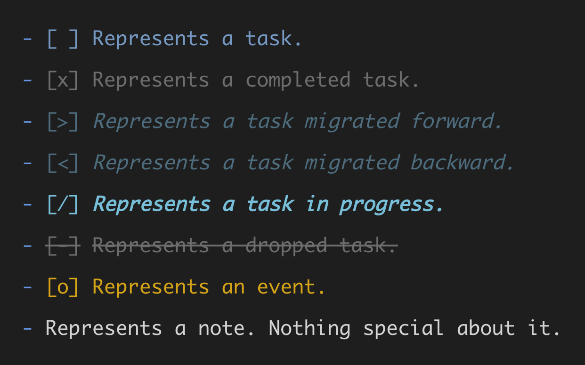
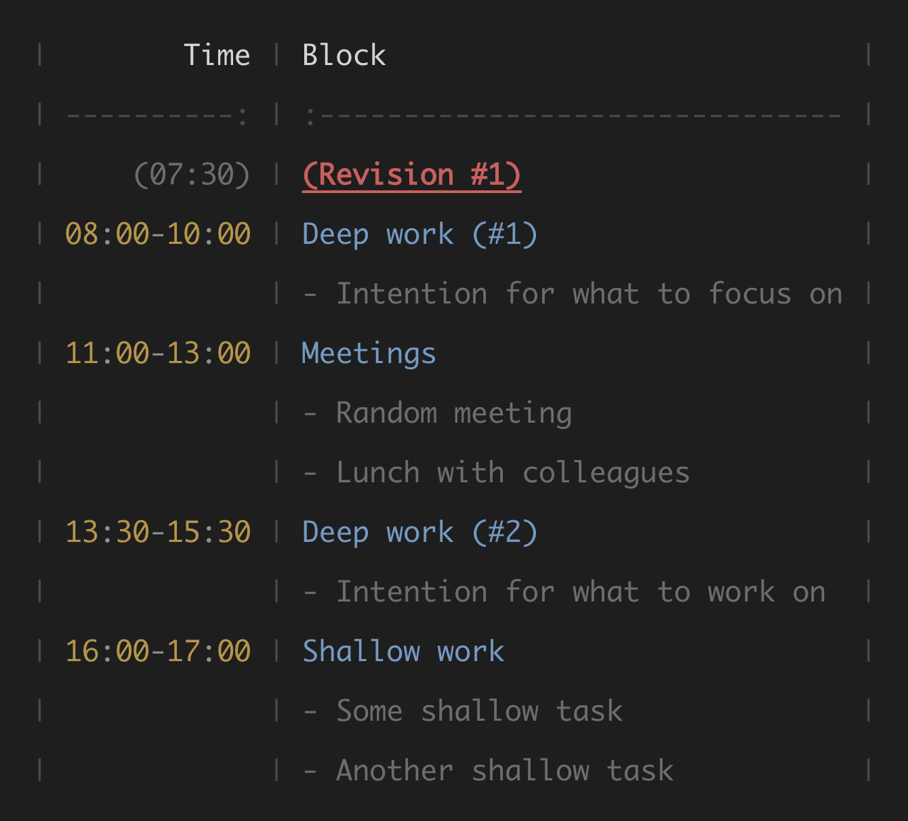

    

<h1 align="center">Bullet Journal Markdown Workflows</h1>

    
    
    
    
    

 

[**BuJo**](https://bujo.mihaiconstantin.com) is a [VS
Code](https://code.visualstudio.com/) extension that adds syntax highlighting
for Bullet Journal entries and provides convenient commands, snippets,
keybindings, and more for managing tasks and notes in Markdown. It works best in
combination with [Dendron](https://github.com/dendronhq/dendron) or
[Foam](https://github.com/foambubble/foam) for an awesome way to turn your text
editor into a full-fledged personal knowledge management and productivity
system.

## Features

### Syntax Highlighting

At the highlighting syntax level, **BuJo** parses the text written in Markdown
files for specific patterns and allows arbitrary colors to be mapped to
different parts of a **BuJo** entry. Out of the box, **BuJo** provides
highlighting for the standard Bullet Journal entries proposed by [Carroll
(2018)](https://bulletjournal.com/pages/book). It also provides a way to select
and colorize markdown table grids, and tasks and time records within tables.

    <h4>BuJo Entries</h4>
    

    <h4>Time Blocking</h4>
    

    <h4>Time Tracking</h4>
    

### Task Management

**BuJo** goes beyond syntax highlighting and taps into time tracking and time
blocking methodologies (e.g., [Newport,
2016](https://www.goodreads.com/book/show/25744928-deep-work)). To this end,
**BuJo** proposes commands and keybindings to effortlessly update task statuses,
plan working days, and track the time spent on tasks.

| Name                              | Description                 |    Context    |
| :-------------------------------- | :-------------------------- | :-----------: |
| `bujo.symbol.setMigratedForward`  | BuJo: Set Migrated Forward  |     entry     |
| `bujo.symbol.setMigratedBackward` | BuJo: Set Migrated Backward |     entry     |
| `bujo.symbol.setCompleted`        | BuJo: Set Completed         |     entry     |
| `bujo.symbol.setOpened`           | BuJo: Set Open              |     entry     |
| `bujo.symbol.setStarted`          | BuJo: Set Started           |     entry     |
| `bujo.symbol.setDropped`          | BuJo: Set Dropped           |     entry     |
| `bujo.scheduler.scheduleEntry`    | BuJo: Schedule Entry        | time tracking |
| `bujo.tracker.recordTime`         | BuJo: Record Time           | time tracking |
| `bujo.tracker.calculateEntryTime` | BuJo: Calculate Entry Time  | time tracking |

 

<h3 align="center">
    Check out the <a href="https://bujo.mihaiconstantin.com"><b>guide</b></a> at
    <a href="https://bujo.mihaiconstantin.com">bujo.mihaiconstantin.com</a> for
    an overview of what <a href="https://bujo.mihaiconstantin.com"><b>BuJo</b></a> can do.
</h3>

 

## Release Notes

See the [CHANGELOG](CHANGELOG.md) file.

## Contributing

Any contributions, suggestions, or bug reports are welcome and greatly
appreciated.

## Roadmap
For planned features, please visit our [project
page](https://github.com/users/mihaiconstantin/projects/1). Any ideas and
discussions are welcome!

## License
`BuJo` is licensed under the [MIT license](LICENSE).

## References
- Carroll, R. (2018). *The bullet journal method: Track the past, order the
  present, design the future.* Penguin.
- Newport, C. (2016). *Deep Work: Rules for Focused Success in a Distracted
  World.* Hachette UK.
