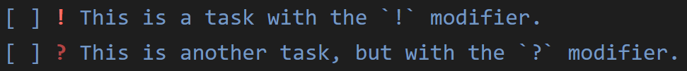

# BuJo

**BuJo** is an extension that adds syntax highlighting for Bullet Journal items (e.g., tasks, notes, etc.) in Markdown.
It works by parsing the text written in Markdown files for specific patterns and highlighting the matches.
At its core, **BuJo** uses the VS Code API for injecting language grammars (i.e., see [VS Code documentation](https://code.visualstudio.com/api/language-extensions/syntax-highlight-guide) for more details).

## Features

**BuJo** provides highlighting for the standard Bullet Journal symbols (i.e., see [Carroll, 2018](https://bulletjournal.com/pages/book)). 

For each Bullet Journal entry, you can highlight four different tokens. Take, for example, the Bullet Journal entry below: 

> `[x] Write BuJo readme file.`

**BuJo** uses the **notation** `[]` to indicate that the text that follows is a Bullet Journal entry. The `x` inside `[]` represents the **symbol** that describes the type of Bullet Journal entry. The **text** that follows (i.e., `Write BuJo readme file.`) represents the content of the entry.

Aside from the notation, symbol, and text, you may also use a **modifier**. For example, you can use the `!` modifier after `[x]` to indicate a sense of priority:

> `[x] ! Write BuJo readme file.`

### Bullet Journal symbols
Below is a list with the supported Bullet Journal symbols:

    [ ] represents a task
    [x] represents a completed task
    [>] represents a task migrated forward
    [<] represents a task migrated backward
    [o] represents an event
    [-] represents a note

With the **BuJo** colors and the default **Dark+** theme, the symbols above get highlighted as follows:


Note that, although not visible, the notation brackets `[]` are still present (e.g., `[x]`). With the default colors, the notation brackets are made transparent to keep the entry clean and emphasize the content.

### Bullet Journal modifiers
Below is the list of supported Bullet Journal modifiers:

    ! indicates, e.g., priority, inspiration, etc.
    ? indicates, e.g., waiting for someone or something, unclear, etc.

These modifiers can be combined with any of the supported Bullet Journal symbols. For example, they can be applied to a task:

    [ ] ! This is a task with the `!` modifier.
    [ ] ? This is another task, but with the `?` modifier.

In which case, with the default **BuJo** colors you get:



### Exposed TextMate scopes
Below are the **TextMate scopes** targeted in the VS Code settings for color customizations.

For completed tasks (i.e., `[x]`):

- `bujo.task.notation`: targets the left `[` and the right `]` barkets only when the symbol `x` is inbetween
- `bujo.task.symbol`: targets the symbol `x` in between the notation barkets `[` and `]`  
- `bujo.task.modifier.exclamation`: targets the modifier `!` that follows after `[x]`
- `bujo.task.modifier.question`: targets the modifier `?` that follows after `[x]`
- `bujo.task.text`: targets the **text** that follows `[x]` **without a modifier**, e.g., `[x]` __`This is targeted.`__
- `bujo.task.text.modifier.exclamation`: targets the **text** that follows `[x] ! `
- `bujo.task.text.modifier.question`: targets the **text** that follows `[x] ? `

The same pattern holds for the other symbols as well. You only need to replace the keyword `task` with the name of the symbol you are interested in targeting. For example, the all scopes for targeting the notation barkets are:

- for tasks: `bujo.task.notation`
- for completed tasks: `bujo.task.done.notation`
- for forward migrated tasks: `bujo.task.migrate.forward.notation`
- for backward migrated tasks: `bujo.task.migrate.backward.notation`
- for events: `bujo.event.notation`
- for notes: `bujo.note.notation`


## Extension Settings

### Overriding default colors and styles

The TextMate scopes expose by **BuJo** can be colorized via the `editor.tokenColorCustomizations` setting in VS Code.

```jsonc
{
    // Other VS Code settings.

    "editor.tokenColorCustomizations": {
        "textMateRules": [
            // The scopes for which we want to provide custom colors.
        ]
    }
}
```

For example, to colorize the notation brackets `[` and `]` for a task `[x]`, you can use:

```jsonc
{
    // Other VS Code settings.

    "editor.tokenColorCustomizations": {
        "textMateRules": [
            { 
                "scope": "bujo.task.done.notation", 
                "settings": { 
                    "foreground": "#FFB6C1",
                    "fontStyle": "bold underline"
                } 
            }
        ]
    }
}
```

Which will result in a completed task with bolded, underlined, and pink notation:


### Adding default colors and styles

To the best of my knowledge, VS Code does not currently support adding default token color customizations via `contributes.configurationDefaults`.
Therefore, to use this extension, you are required to manually set the colors for the **BuJo** scopes you want to colorize.

I recommend the following colors chosen to work well with the default **Dark+** theme in VS Code. 
You can copy and paste the configuration below to your `settings.json` file.

You can adjust any colors however you see fit.

```jsonc
{
    // Other VS Code settings.

    // Copy this one.
    "editor.tokenColorCustomizations": {
        "textMateRules": [
            // BuJo highlights for notes.
            { "scope": "bujo.note.notation", "settings": { "foreground": "#1E1E1E" } },
            { "scope": "bujo.note.symbol", "settings": { "foreground": "#CECECE" } },
            { "scope": "bujo.note.modifier.exclamation", "settings": { "foreground": "#FF6E64", "fontStyle": "bold" } },
            { "scope": "bujo.note.modifier.question", "settings": { "foreground": "#B14545", "fontStyle": "bold" } },
            { "scope": "bujo.note.text", "settings": { "foreground": "#CECECE" } },
            { "scope": "bujo.note.text.modifier.exclamation", "settings": { "foreground": "#CECECE" } },
            { "scope": "bujo.note.text.modifier.question", "settings": { "foreground": "#CECECE" } },

            // BuJo highlights for events.
            { "scope": "bujo.event.notation", "settings": { "foreground": "#1E1E1E" } },
            { "scope": "bujo.event.symbol", "settings": { "foreground": "#D6A418" } },
            { "scope": "bujo.event.modifier.exclamation", "settings": { "foreground": "#FF6E64", "fontStyle": "bold" } },
            { "scope": "bujo.event.modifier.question", "settings": { "foreground": "#B14545", "fontStyle": "bold" } },
            { "scope": "bujo.event.text", "settings": { "foreground": "#D6A418" } },
            { "scope": "bujo.event.text.modifier.exclamation", "settings": { "foreground": "#D6A418" } },
            { "scope": "bujo.event.text.modifier.question", "settings": { "foreground": "#D6A418" } },

            // BuJo highlights for tasks not completed.
            { "scope": "bujo.task.notation", "settings": { "foreground": "#7599C3" } },
            { "scope": "bujo.task.symbol", "settings": { "foreground": "#00000000" } },
            { "scope": "bujo.task.modifier.exclamation", "settings": { "foreground": "#FF6E64", "fontStyle": "bold" } },
            { "scope": "bujo.task.modifier.question", "settings": { "foreground": "#B14545", "fontStyle": "bold" } },
            { "scope": "bujo.task.text", "settings": { "foreground": "#7599C3" } },
            { "scope": "bujo.task.text.modifier.exclamation", "settings": { "foreground": "#7599C3", "fontStyle": "bold" } },
            { "scope": "bujo.task.text.modifier.question", "settings": { "foreground": "#7599C3" } },

            // BuJo highlights for tasks migrated forward.
            { "scope": "bujo.task.migrate.forward.notation", "settings": { "foreground": "#1E1E1E" } },
            { "scope": "bujo.task.migrate.forward.symbol", "settings": { "foreground": "#4D6C7D" } },
            { "scope": "bujo.task.migrate.forward.modifier.exclamation", "settings": { "foreground": "#FF6E64", "fontStyle": "bold" } },
            { "scope": "bujo.task.migrate.forward.modifier.question", "settings": { "foreground": "#B14545", "fontStyle": "bold" } },
            { "scope": "bujo.task.migrate.forward.text", "settings": { "foreground": "#4D6C7D" } },
            { "scope": "bujo.task.migrate.forward.text.modifier.exclamation", "settings": { "foreground": "#4D6C7D" } },
            { "scope": "bujo.task.migrate.forward.text.modifier.question", "settings": { "foreground": "#4D6C7D" } },
            
            // BuJo highlights for tasks migrated backward.
            { "scope": "bujo.task.migrate.backward.notation", "settings": { "foreground": "#1E1E1E" } },
            { "scope": "bujo.task.migrate.backward.symbol", "settings": { "foreground": "#4D6C7D" } },
            { "scope": "bujo.task.migrate.backward.modifier.exclamation", "settings": { "foreground": "#FF6E64", "fontStyle": "bold" } },
            { "scope": "bujo.task.migrate.backward.modifier.question", "settings": { "foreground": "#B14545", "fontStyle": "bold" } },
            { "scope": "bujo.task.migrate.backward.text", "settings": { "foreground": "#4D6C7D" } },
            { "scope": "bujo.task.migrate.backward.text.modifier.exclamation", "settings": { "foreground": "#4D6C7D" } },
            { "scope": "bujo.task.migrate.backward.text.modifier.question", "settings": { "foreground": "#4D6C7D" } },

            // BuJo highlights for completed tasks.
            { "scope": "bujo.task.done.notation", "settings": { "foreground": "#1E1E1E" } },
            { "scope": "bujo.task.done.symbol", "settings": { "foreground": "#6D6D6D" } },
            { "scope": "bujo.task.done.modifier.exclamation", "settings": { "foreground": "#6D6D6D", "fontStyle": "bold" } },
            { "scope": "bujo.task.done.modifier.question", "settings": { "foreground": "#6D6D6D", "fontStyle": "bold" } },
            { "scope": "bujo.task.done.text", "settings": { "foreground": "#6D6D6D" } },
            { "scope": "bujo.task.done.text.modifier.exclamation", "settings": { "foreground": "#6D6D6D" } },
            { "scope": "bujo.task.done.text.modifier.question", "settings": { "foreground": "#6D6D6D" } }
        ]
    }
}
```


## Release Notes

### 1.0.0

Initial release of **BuJo** with standard Bullet Journal symbols and two modifiers.

- Added TextMate scopes for standard Bullet Journal symbols
    - `[ ]` task
    - `[x]` completed task
    - `[>]` migrated forward task
    - `[<]` migrated backward task
    - `[o]` event
    - `[-]` note
- Added TextMate scopes for two modifiers `!` and `?`

## References
- Carroll, R. (2018). *The bullet journal method: Track the past, order the present, design the future.* Penguin.
